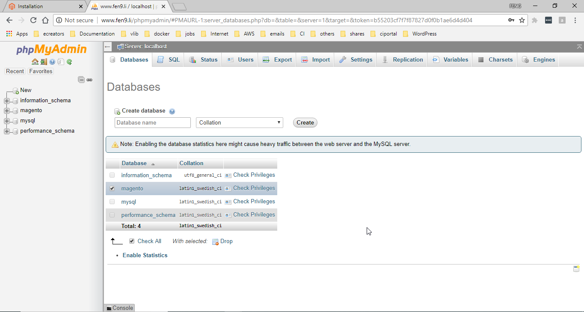
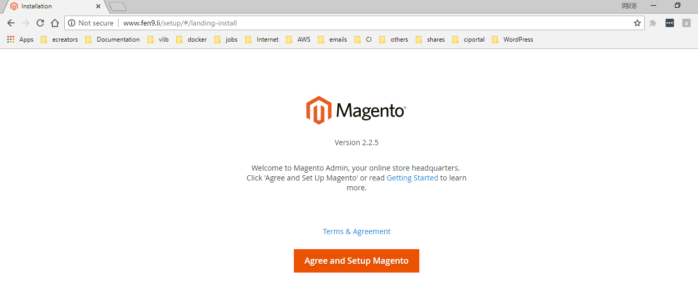

# Demo of Setting Up Magento


## Prepare Magento Server
### Create Virtual Machine 

*	vCPU: 		2
*	Memory: 	2GiB
*	NICs: 		1 * NAT
*	Hard Disk: 	20GiB 
>	  /boot 		512MiB / Standard Partition / xfs
>	  swap: 		2GiB / lvm / swap
>	  / 		10GiB / lvm / xfs

### Configure Host 'magento65.fen9.li' basics

```
hostname=magento65.fen9.li
ipaddr="192.168.200.65/24"
hostnamectl set-hostname $hostname
nmcli con add con-name ens33-fix type ethernet ifname ens33 autoconnect yes ip4 $ipaddr gw4 192.168.200.2
nmcli con mod ens33-fix ipv4.dns 192.168.200.2

echo '192.168.200.65  magento65.fen9.li    magento65' >> /etc/hosts

shutdown -r now
```

### Install MariaDB

```
[root@magento65 ~]# yum -y install mariadb-server mariadb
[root@magento65 ~]# systemctl enable mariadb
[root@magento65 ~]# systemctl start mariadb

[root@magento65 ~]# systemctl status mariadb
● mariadb.service - MariaDB database server
   Loaded: loaded (/usr/lib/systemd/system/mariadb.service; enabled; vendor preset: disabled)
   Active: active (running) since Fri 2018-08-24 19:12:11 AEST; 4s ago
  Process: 2292 ExecStartPost=/usr/libexec/mariadb-wait-ready $MAINPID (code=exited, status=0/SUCCESS)
  Process: 2211 ExecStartPre=/usr/libexec/mariadb-prepare-db-dir %n (code=exited, status=0/SUCCESS)
 Main PID: 2291 (mysqld_safe)
   CGroup: /system.slice/mariadb.service
           ├─2291 /bin/sh /usr/bin/mysqld_safe --basedir=/usr
           └─2453 /usr/libexec/mysqld --basedir=/usr --datadir=/var/lib/mysql --plugin-dir=/usr/lib64/mysql/...

...
Hint: Some lines were ellipsized, use -l to show in full.
[root@magento65 ~]#

[root@magento65 ~]# mysql_secure_installation

NOTE: RUNNING ALL PARTS OF THIS SCRIPT IS RECOMMENDED FOR ALL MariaDB
      SERVERS IN PRODUCTION USE!  PLEASE READ EACH STEP CAREFULLY!
...
Cleaning up...

All done!  If you've completed all of the above steps, your MariaDB
installation should now be secure.

Thanks for using MariaDB!
[root@magento65 ~]#
```

### Install apache httpd server and turn on firewall ports

```
yum -y install httpd
systemctl enable httpd
systemctl start httpd

firewall-cmd --permanent --zone=public --add-service={http,https}
firewall-cmd --reload
```

### Install php and its extensions
```
[root@magento65 ~]# rpm -Uvh http://rpms.remirepo.net/enterprise/remi-release-7.rpm
[root@magento65 ~]# yum -y install yum-utils

[root@magento65 ~]# yum -y update

[root@magento65 ~]# yum-config-manager --enable remi-php71
[root@magento65 ~]# yum -y install php php-opcache

[root@magento65 ~]# php --version
PHP 7.1.21 (cli) (built: Aug 15 2018 17:56:55) ( NTS )
Copyright (c) 1997-2018 The PHP Group
Zend Engine v3.1.0, Copyright (c) 1998-2018 Zend Technologies
    with Zend OPcache v7.1.21, Copyright (c) 1999-2018, by Zend Technologies
[root@magento65 ~]#

[root@magento65 ~]# yum -y install php-mysqlnd php-pdo
[root@magento65 ~]# yum -y install php-gd php-dom php-simplexml php-bcmath php-intl php-xsl php-mbstring php-zip php-soap

[root@magento65 ~]# systemctl restart httpd
```

### Install composer
```
[root@magento65 ~]# curl -sS https://getcomposer.org/installer | php
[root@magento65 ~]# mv composer.phar /usr/local/bin/composer
[root@magento65 ~]# chmod +x /usr/local/bin/composer

[root@magento65 /]# exit
logout
[fli@magento65 ~]$ composer --version
Composer version 1.7.2 2018-08-16 16:57:12
[fli@magento65 ~]$
```

### Install phpMyAdmin (optional)
```
[root@magento65 ~]# yum -y install phpMyAdmin

[root@magento65 ~]# vim /etc/httpd/conf.d/phpMyAdmin.conf
[root@magento65 ~]# cat /etc/httpd/conf.d/phpMyAdmin.conf
......
<Directory /usr/share/phpMyAdmin/>
   AddDefaultCharset UTF-8

   <IfModule mod_authz_core.c>
     # Apache 2.4
     <RequireAny>
       Require ip 192.168.200.1
       Require ip 127.0.0.1
       Require ip ::1
     </RequireAny>
   </IfModule>
   <IfModule !mod_authz_core.c>
     # Apache 2.2
     Order Deny,Allow
     Deny from All
     Allow from 192.168.200.1
     Allow from 127.0.0.1
     Allow from ::1
   </IfModule>
</Directory>
......
[root@magento65 ~]#

[root@magento65 ~]# cp /etc/phpMyAdmin/config.inc.php /etc/phpMyAdmin/config.inc.php.orig
[root@magento65 ~]# vim /etc/phpMyAdmin/config.inc.php
[root@magento65 ~]# diff /etc/phpMyAdmin/config.inc.php /etc/phpMyAdmin/config.inc.php.orig
41c41
< $cfg['Servers'][$i]['auth_type']     = 'http';    // Authentication method (config, http or cookie based)?
---
> $cfg['Servers'][$i]['auth_type']     = 'cookie';    // Authentication method (config, http or cookie based)?
[root@magento65 ~]#

[root@magento65 ~]# systemctl restart httpd
```

## Install Magento

### Increase PHP memory limit for Magento in php.ini (PHP configuration) file
[root@magento65 ~]# php -i | grep php.ini
Configuration File (php.ini) Path => /etc
Loaded Configuration File => /etc/php.ini
[root@magento65 ~]#
[root@magento65 ~]# cp /etc/php.ini /etc/php.ini.orig
[root@magento65 ~]# vim /etc/php.ini
[root@magento65 ~]# diff /etc/php.ini /etc/php.ini.orig
389c389
< memory_limit = 512M
---
> memory_limit = 128M
[root@magento65 ~]#

### Install PHP mcrypt package if not yet
```
[root@magento65 ~]# yum list installed | grep php-mcrypt
[root@magento65 ~]#

[root@magento65 ~]# yum -y install php-mcrypt*

[root@magento65 ~]# systemctl restart httpd
```

### Create 'magento' database and user in mariadb
```
[root@magento65 ~]# mysql -u root -ppassword
Welcome to the MariaDB monitor.  Commands end with ; or \g.
Your MariaDB connection id is 12
Server version: 5.5.60-MariaDB MariaDB Server

Copyright (c) 2000, 2018, Oracle, MariaDB Corporation Ab and others.

Type 'help;' or '\h' for help. Type '\c' to clear the current input statement.

MariaDB [(none)]> 

MariaDB [(none)]> CREATE DATABASE magento;
...
MariaDB [(none)]> GRANT ALL ON magento.* TO magentouser@localhost IDENTIFIED BY 'magentopassword';
...
MariaDB [(none)]> flush privileges;
...
MariaDB [(none)]> quit;
Bye
[root@magento65 ~]# 
```

### Confirm new database has been created successfully



### Install Magento now
```
[root@magento65 ~]# wget https://github.com/magento/magento2/archive/2.2.zip

[root@magento65 ~]# unzip 2.2.5.zip

[root@magento65 ~]# mv magento2-2.2 /var/www/magento

[root@magento65 ~]# cd /var/www
[root@magento65 www]# chown -R apache. magento
[root@magento65 www]# chmod -R 775 magento

[root@magento65 www]# vim /etc/httpd/conf.d/magento.conf
[root@magento65 www]# cat /etc/httpd/conf.d/magento.conf
<VirtualHost *:80>
  ServerName www.fen9.li
  DocumentRoot /var/www/magento/

  <Directory /var/www/magento/>
    AllowOverride All
    allow from all
  </Directory>
</VirtualHost>
[root@magento65 www]# cd

[root@magento65 ~]# BaseDir="/var/www/magento"
[root@magento65 ~]# setfacl -R -m u:fli:rwx $BaseDir
[root@magento65 ~]# setfacl -R -m d:u:fli:rwx $BaseDir
[root@magento65 ~]# semanage fcontext -a -t httpd_sys_content_t "$BaseDir(/.*)?"
[root@magento65 ~]# restorecon -R "$BaseDir"

[root@magento65 ~]# systemctl restart httpd

[root@magento65 www]# exit
[fli@magento65 ~]$ cd /var/www/magento/
[fli@magento65 magento]$

[fli@magento65 magento]$ composer install
Loading composer repositories with package information
Installing dependencies (including require-dev) from lock file
Package operations: 117 installs, 0 updates, 0 removals
  - Installing magento/magento-composer-installer (0.1.13): Downloading (100%)
…
phpunit/phpunit suggests installing phpunit/php-invoker (^1.1)
Generating autoload files
[fli@magento65 magento]$

```

### Test starting magento setting up page successfully


